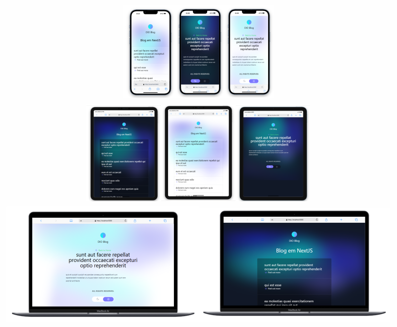

# ⚡ Projeto - Blog de Notícias

## 🚀 Bem-vindo ao projeto Blog de Notícias!

Este projeto foi desenvolvido com:

- **🌐 React**
- **🎨 Tailwind CSS**
- **🔗 API RESTfull: [JSONPlaceholder](https://jsonplaceholder.typicode.com/) para testes e desenvolvimento**
- **☀️🌒 Theme Switcher (ou Alternador de Tema)**

## Instruções para rodar o projeto

Antes de começar, certifique-se de ter o **Node.js** e o **npm** ou **yarn** instalados em seu ambiente de desenvolvimento.

- **Node.js**: [Baixar Node.js](https://nodejs.org/)
- **npm** (gerenciador de pacotes do Node.js): Geralmente instalado junto com o Node.js
- **Yarn**: [Baixar Yarn](https://yarnpkg.com/)

### 1. Baixar ou clonar o projeto

Baixe ou clone o repositório do GitHub. Depois, navegue até a pasta do projeto:

```bash
cd blog-noticias-main
```

### 2. Instalar as dependências e bibliotecas

Instale as dependências necessárias do projeto utilizando **npm** e **yarn**:

#### Com npm:
```bash
npm install -D tailwindcss
```

```bash
npm install axios
```

#### Com yarn:
```bash
yarn install
```
### 3. Iniciar o servidor de desenvolvimento

Execute o seguinte comando para rodar o projeto:

#### Com yarn:
```bash
yarn run dev
```

Agora, acesse o projeto no navegador:

[http://localhost:3000](http://localhost:3000)

## Mais Detalhes sobre o Projeto

Este projeto é totalmente responsivo, adaptando-se a diferentes tamanhos de tela e dispositivos.



#### Muito aprendizado, novidades e atualizações incríveis com a DIO! 🚀

